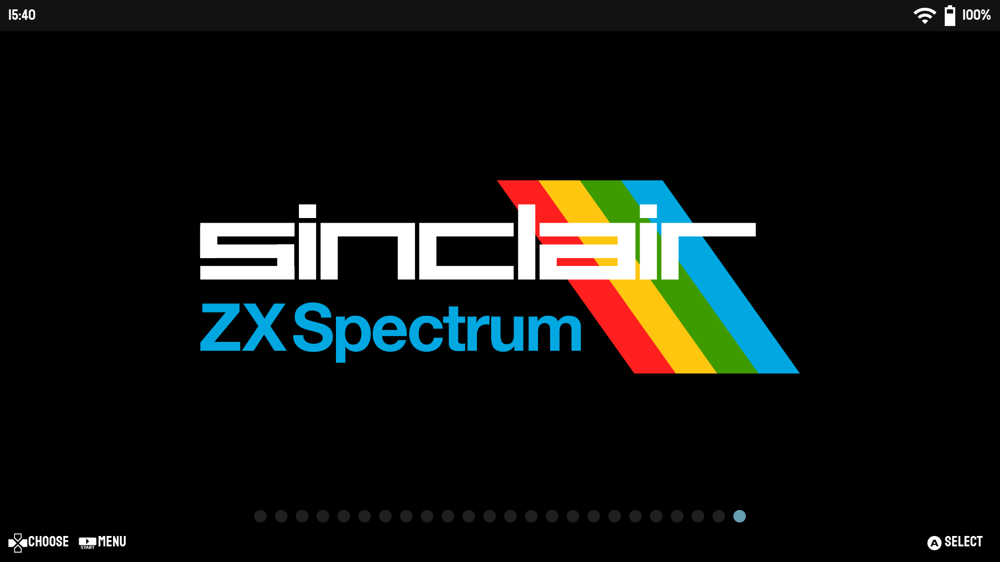
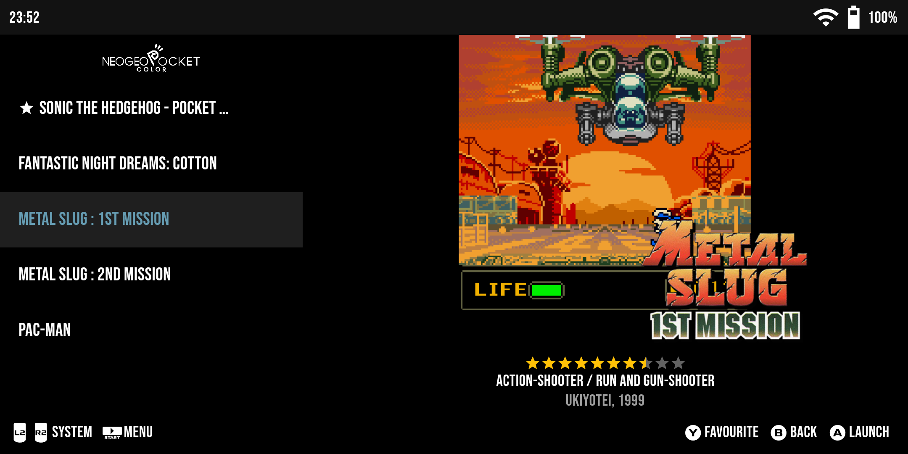

# Titanius Launcher

Titanius Launcher is a minimalistic, controller-first retro game launcher designed for those who want to enjoy a seamless gaming experience on their Android devices. 
Inspired by EmulationStation and AmberELEC, it allows users to easily integrate their pre-scraped ROMs libraries from Linux systems like AmberELEC, JELOS and ArkOS. 

- [x] Designed for Android devices with built-in controllers, such as Odin 2/Lite/Pro, Retroid 4/3/Flip, Anbernic RG552, Logitech G Cloud, ...
- [x] Minimalistic, controller-first UI
- [x] Reuse your existing pre-scraped ROMs library from Linux systems like AmberELEC or use built-in scraper
- [x] Out of the box supports around 70 systems with Retroarch 64-bit and standlone emulators

## Download

Grab the latest apk from the [Releases](https://github.com/dsolonenko/titanius-launcher/releases) page and install it manually.

## How to use

While Titanius Launcher does have built-in scraper, it was designed with the intention of reusing your existing, pre-scraped ROMs library on both Linux devices running AmberELEC/JELOS/ArkOS, etc., and your Android device.

1. Organize your ROMs in a folder structure like this: [AmberELEC](https://amberelec.org/systems/)
2. Use [Skraper](https://www.skraper.net/) to scrape your ROMs and generate `gamelist.xml` files, along with images and/or videos. Have a look at the [Wiki](https://github.com/dsolonenko/titanius-launcher/wiki/Skraper-Settings) for the best settings.
3. Transfer your ROMs to your Android device's Internal Storage or SD card in one of these locations: `Internal Storage/Roms`, `SD Card/. (Root)`, `SD Card/Roms`
4. Set up Titanius Launcher to include the ROMs folder
5. Have fun!

## Scraper

Titanius Launcher has a built-in scraper that uses [Screenscraper](https://www.screenscraper.fr) APIs for scraping ROMs metadata and media.
To use it, navigate to Settings -> Scraper and select the systems you want to scrape.
You can also scrape individual games by going into game settings and selecting "Scrape Game".

Mind that scraper requires to calculate checksums for each ROM file, which can take a while for large files.
While it works just fine for most systems, it can take minutes per rom for CD-based systems like PS2 and GameCube, so it's recommended to scrape them on a PC and transfer the metadata to your Android device. 

The scraper is still work in progress, some things dont work yet like folders support.

## Standalone Emulators

Due to the Storage Access Framework (SAF) restrictions, you might have to grant Titanius Launcher permission to share ROM files with standalone emulators. 
To accomplish this, navigate to Settings -> ROMs Folders -> Add Shared Folder and add the relevant folders. Ensure that these folders correspond to the ones used in your standalone emulators. 
For instance, if you're using the standalone Drastic for DS, the shared folder in Titanius Launcher and the Drastic folder should both be set to `[ROMs Folder Location]/Roms/nds`.

## Custom Emulators

Sometimes it is necessary to use a custom emulator for a particular system. To do so, navigate to Settings -> Custom Emulators and add a new emulator.
You'll need to provide the emulator's name and `am start` command. For examples, please check launch commands in the [Pegasus config generator](https://pegasus-frontend.org/tools/metagen-android/).

## Daijishō Wallpaper Packs

Titanius Launcher supports [Daijishō Wallpaper Packs](https://daijishou.github.io/Gallery/).
All credit goes to the original contributors. The images are loaded over network directly from the Daijishō's GitHub repo, so you'll need an internet connection to use them.

## Notes

1. Expect some bugs.
2. All ROMs metadata is stored in EmulationStation's `gamelist.xml` files.
3. Offers minimal required functionality. If you're seeking something more robust, [Daijishō](https://github.com/magneticchen/Daijishou) is highly recommended.
4. Currently configured with [Retroarch 64-bit](https://buildbot.libretro.com/stable/1.15.0/android/RetroArch_aarch64.apk) and a few standalone emulators. For a list of supported systems and emulators, see this [JSON config file](assets/metadata.json).
5. Can function as a home launcher or a standalone frontend.
6. Relies on the controller, touch interface can be hit and miss

## Screenshots

Landing page with a scrolling list of systems:

Games page:

Game details:

Folders support:

Collections:

Android apps:

Settings:

## Attributions

- [Staatliches Font designed by Brian LaRossa, Erica Carras](https://fonts.google.com/specimen/Staatliches/about)
- [PromptFont by Shinmera](https://github.com/Shinmera/promptfont/)
- [Console logos created by Dan Patrick](https://archive.org/details/console-logos-professionally-redrawn-plus-official-versions)
- [App icon created by Irfansusanto20 - Flaticon](https://www.flaticon.com/free-icons/game-console)
- [Daijishō contributors for Wallpaper Packs](https://daijishou.github.io/Gallery/)
- Initial emulators configs imported from Daijishō and Pegasus Frontend
